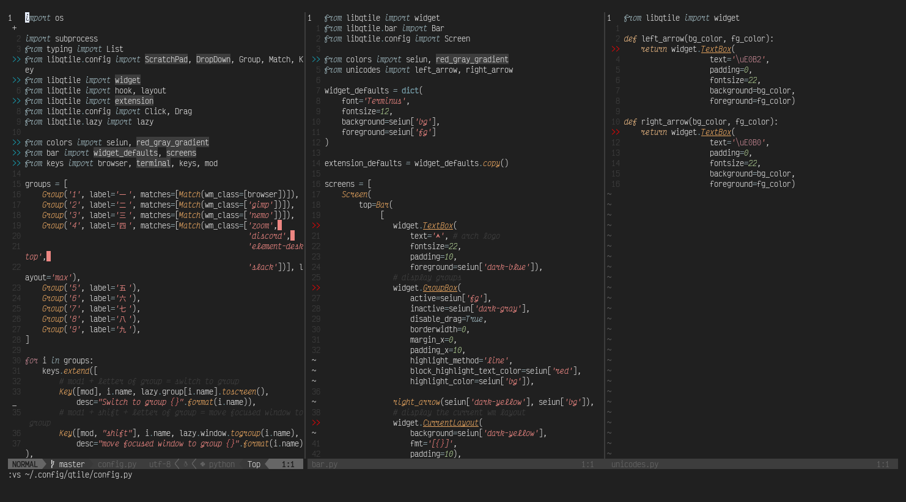

seiun is a colorscheme designed for vim andk created with [vim-rnb]() and is inspired by the gruvbox colorscheme.

Example using seiun colorscheme with python
---

Notes
---
I am still experimenting with this colorscheme

License
---
[MIT License](https://mit-license.kcak11.com/)
